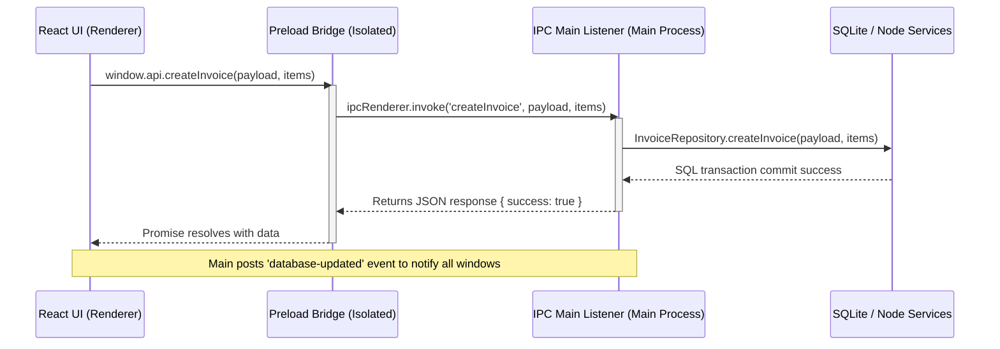

# 01 - SwarnPro ERP Project Overview

Welcome to the **SwarnPro ERP Desktop Client (v1.0.0-PRO)** documentation. This desktop application is built to handle offline-first retail billing, purchase logging, tag catalog stock tracking, double-entry accounting ledger posting, barcode diagnostics, backup, recovery, and optional cloud synchronizations.

---

## 🏗️ Technology Stack

The client utilizes a modern, hybrid desktop stack optimized for high performance, local-first storage, secure cryptographic licensing, and native operating system integration:

* **Desktop Application Shell**: [Electron.js](https://www.electronjs.org/) (v30+) running Node.js in the main process and Chromium in the renderer process.
* **Front-End Framework**: React (v18+) with TypeScript for static type-safety.
* **Build System**: Vite for fast hot-module reloading and module bundling.
* **Styling Engine**: Tailwind CSS combined with standard utility classes and Lucide React icons.
* **State Management**: [Zustand](https://github.com/pmndrs/zustand) for reactive, light-weight client-side stores (Company, Product, Party, Tax, Invoices, Vouchers, Daily Rates).
* **Local Database Engine**: [better-sqlite3](https://github.com/WiseLibs/better-sqlite3) wrapper compiling SQLite3 dynamically inside the Electron Node environment.
* **System Utilities**: Cryptography (via native `crypto` module), Compression (`zlib` streams), and Windows OS hardware checks via powershell child-process commands.

---

## 📁 Repository Directory Structure

Below is the layout of the codebase, organized to enforce a strict boundary between main process repositories/services and the renderer process UI view canvas.

```
SwarnProERP/
├── .agents/                 # AI Assistant skills and prompts
├── dist/                    # Compiled assets for production Electron packaging
├── docs/                    # [NEW] Master ERP System Documentation
├── public/                  # Static assets (fonts, images, icons)
├── scripts/                 # Helper scripts for build, seeding, or diagnostics
├── src/
│   ├── main/                # Electron Main Process (Node.js Environment)
│   │   ├── db/              # Database schema migrations & connection hooks
│   │   │   ├── connection.ts # SQLite pool lifecycle manager
│   │   │   └── schema.ts    # Complete schema queries & seed migrations
│   │   ├── ipc/             # Inter-Process Communication
│   │   │   └── handlers.ts  # IPC Main listener routing mappings
│   │   ├── repositories/    # Repository Pattern database layers
│   │   │   ├── base.repository.ts
│   │   │   ├── company.repository.ts
│   │   │   ├── purchase.repository.ts
│   │   │   ├── invoice.repository.ts
│   │   │   ├── ledger.repository.ts
│   │   │   ├── user.repository.ts
│   │   │   └── ...
│   │   ├── services/        # Hardware/OS Integration Layers
│   │   │   ├── backup.service.ts # Gzip compression stream pipelines
│   │   │   ├── license.service.ts # Windows fingerprinting and AES decryption
│   │   │   └── sync.service.ts   # Internet check and cloud payload synchronization
│   │   └── index.ts         # Main process bootstrapper (Electron window lifecycle)
│   ├── preload/             # Electron Preload Scripts (Isolated bridge context)
│   │   └── index.ts         # IPC Renderer API channel definitions
│   ├── renderer/            # React UI (Browser/Chromium Process)
│   │   ├── assets/          # Page specific images or styles
│   │   ├── components/      # Reusable UI controls and general Layout
│   │   │   ├── layout/      # Sidebar, Top Menu, Status Bar, Quick actions
│   │   │   └── ui/          # Form inputs, tables, selectors
│   │   ├── hooks/           # Hardware scanners hooks
│   │   │   └── useHardwareScanner.ts # HID Key wedge latency diagnostics handler
│   │   ├── pages/           # Screen View modules (e.g. Sales, Purchase, Ledgers)
│   │   ├── store/           # Zustand client data state stores
│   │   ├── types/           # TypeScript types shared across renderer components
│   │   └── main.tsx         # React bootstrap entrypoint
│   └── shared/              # Shared TypeScript definitions & APIs
│       └── ipc-api.ts       # Shared interfaces for IPC payloads
├── package.json             # Root dependency descriptions
├── tailwind.config.js       # Styling theme properties configuration
├── tsconfig.json            # TypeScript configuration
└── vite.config.ts           # Vite compile parameters
```

---

## 🔄 Inter-Process Communication (IPC) Model

Because SQLite operations, filesystem access, child processes (PowerShell), and TCP network sweeps must run in a secure Node.js environment, the frontend cannot call them directly. The system relies on a secure IPC Bridge:



### 🔐 Context Isolation Bridge ([preload/index.ts](file:///d:/SwarnProERP/src/preload/index.ts))
By disabling Node integration inside the frontend browser windows, the application prevents client scripts from running raw OS commands. Access is limited to the channels defined on `window.api`:
- **Transactional APIs**: `createInvoice`, `createPurchaseVoucher`, `createVoucher`, `saveDailyRates`.
- **Administrative APIs**: `getLicenseStatus`, `activateLicense`, `createBackup`, `restoreBackup`, `syncWithCloud`.
- **Real-time Notifier**: `onDatabaseUpdated` triggers the React stores to reload data when another tab or process performs an insert/update.
