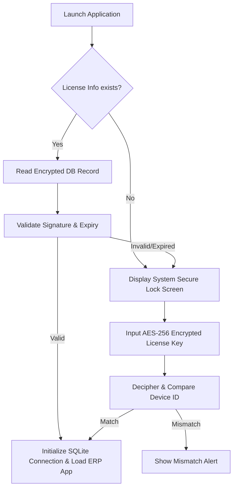

# 03 - System Administrator & Deployment Guide

This guide is written for IT managers, system administrators, and deployment engineers. It explains how to deploy, license, back up, restore, configure cloud sync, and manage user authorization sets in the SwarnPro ERP application.

---

## 🛠️ Installation & Environment Lifecycle

The desktop application is built as an Electron client packaging a local Node.js runtime and SQLite database pool.

### Development Start
To launch the application in development mode:
```powershell
# Install Node modules
npm install

# Compile main process components and run hot-reload Dev Server
npm run dev
```

### Production Packaging
To compile and package the application into a standalone Windows installer (`.exe`):
```powershell
# Builds assets and runs Electron-Builder
npm run build
```
This generates the installation payload inside the `dist/` directory.

---

## 🔑 License Activation & Hardware Fingerprint Lock

The application uses machine-bound licensing. It restricts usage to one computer by locking to a hashed fingerprint of the hardware.



### 1. Hardware Fingerprint Generation
The client runs child process commands to extract hardware descriptors on Windows:
* **CPU ID**: `Get-CimInstance Win32_Processor | Select-Object -ExpandProperty ProcessorId`
* **Motherboard Serial**: `Get-CimInstance Win32_BaseBoard | Select-Object -ExpandProperty SerialNumber`
* **First Disk Serial**: `Get-CimInstance Win32_DiskDrive | Where-Object { $_.Index -eq 0 } | Select-Object -ExpandProperty SerialNumber`
* **Machine GUID**: Query Registry Key `HKLM\SOFTWARE\Microsoft\Cryptography` value `MachineGuid`

These descriptors are concatenated and hashed via SHA-256 to generate the 64-character uppercase **Device ID**:
$$\text{Device ID} = \text{SHA256}(\text{"CPU:}[cpuId]\text{\|MB:}[mbSerial]\text{\|DISK:}[diskSerial]\text{\|GUID:}[machineGuid]\text{"})$$

### 2. License Decryption & Verification
The Admin generates the license key using a utility. The key is an AES-256-CBC encrypted JSON string of:
```json
{
  "deviceId": "HASH_OF_THE_MACHINE",
  "expiryDate": "2030-12-31",
  "created": "2026-06-22T00:00:00Z"
}
```
The client decrypts this string using the secret key derived from `LICENSE_SECRET_KEY` ('swarnpro_erp_ENTERPRISE_SECRET_KEY_2026'). If the decrypted `deviceId` matches the machine's active Device ID, the license is saved to `license_info` and access is granted.

---

## 🗄️ Database Architecture & Migrations

The database is built on SQLite. SQLite offers low latency, zero configuration, and transactional safety (ACID compliance) for offline-first installations.

* **Database Path**: The database file `swarnpro_erp.db` is stored locally in the user's home app directory (usually `C:\Users\<Username>\AppData\Roaming\SwarnProERP\db\swarnpro_erp.db`).
* **Migrations Framework**: The migration scripts are located in [schema.ts](file:///d:/SwarnProERP/src/main/db/schema.ts#L508-L700). On startup, the application verifies the schema and runs database migrations:
  - Validates `companies` table fields.
  - Adds missing columns, such as `permissions_json` to `users` and `rates_json`/`employee` to `daily_rates`.
  - Migrates foreign key references dynamically (e.g., updating `sales_invoices.customer_id` from `customers(id)` to reference `parties(id)`).
  - Seeds default GST rates (`0%`, `1%`, `3%`, `5%`, `12%`, `18%`, `28%`, `TCS 0.075%`, `TDS 0.1%`) if the `taxes` table is empty.

---

## 💾 Database Backup & Restore Procedures

Database backups use compressed Gzip streams to minimize file size and avoid resource locks.

### Backup Process ([backup.service.ts](file:///d:/SwarnProERP/src/main/services/backup.service.ts#L11-L59))
1. Checks if the source SQLite database file exists.
2. Locates or creates the backup folder (default is `C:\Users\<Username>\Documents\SwarnProERP_Backups`).
3. Appends a timestamp to the file name: `swarnpro_erp_backup_YYYY-MM-DDTHH-MM-SS-MS.db.gz`.
4. Opens a read stream on the SQLite file, pipes it through a Gzip compression stream, and writes the output as a `.db.gz` file.

### Restore Process ([backup.service.ts](file:///d:/SwarnProERP/src/main/services/backup.service.ts#L64-L107))
1. Verifies that the backup file exists.
2. **Closes the active database connection pool** (`closeDatabase()`) to unlock the SQLite file.
3. Decompresses the backup file and overwrites the active database file:
   `Gzip.decompressStream(backupFile) -> writeStream(app.db)`.
4. **Reinitializes the connection pool** (`initDatabase()`) and updates the frontend context via IPC.

---

## ☁️ Cloud Sync System

The Cloud Sync system is optional and designed to synchronize local transactions with a central database.

### Sync Process Flow
1. **Network Check**: Pings Google DNS (`8.8.8.8`) with a 1-second timeout.
2. **Payload Extraction**: Gathers records for the active company from tables: `companies`, `users`, `products`, `customers`, `suppliers`, `accounts`, `parties`, `taxes`, `daily_rates`, `sales_invoices`, `sales_items`, `journal_entries`, `journal_items`, `tag_opening_vouchers`, `tag_opening_items`, `tag_opening_accessories`, `purchase_vouchers`, `purchase_items`, `purchase_tags`, and `purchase_diamonds`.
3. **HTTP Push**: If a `cloudSyncUrl` is specified in Company Settings, sends a POST request with the JSON payload and the `cloudSyncToken` header.
4. **Local Merge**: Integrates remote updates and resolves data conflicts locally.

---

## 👥 User Roles & Access Management

The system enforces role-based access control (RBAC).

| User Role | Dashboard | Inventory Masters | Sales Billing | Purchase Entry | Vouchers & Ledgers | Admin Settings |
| :--- | :---: | :---: | :---: | :---: | :---: | :---: |
| **Admin** | Read/Write | Read/Write | Read/Write | Read/Write | Read/Write | Read/Write |
| **Manager** | Read-Only | Read/Write | Read/Write | Read-Only | Read-Only | Blocked |
| **Accountant** | Read-Only | Blocked | Read-Only | Read-Only | Read/Write | Blocked |
| **Salesman** | Blocked | Blocked | Read/Write | Blocked | Blocked | Blocked |

* **Custom Permissions**: Admins can override access rules by updating the `permissions_json` field in the user's database record (stored as a JSON string on the `users` table).
