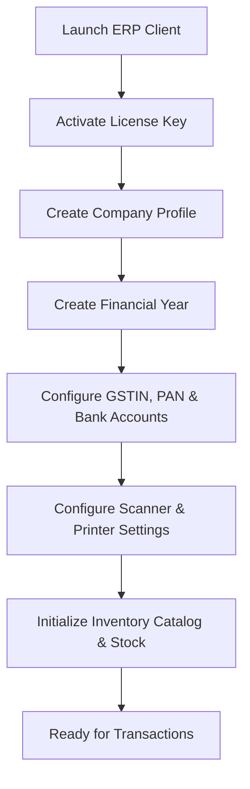
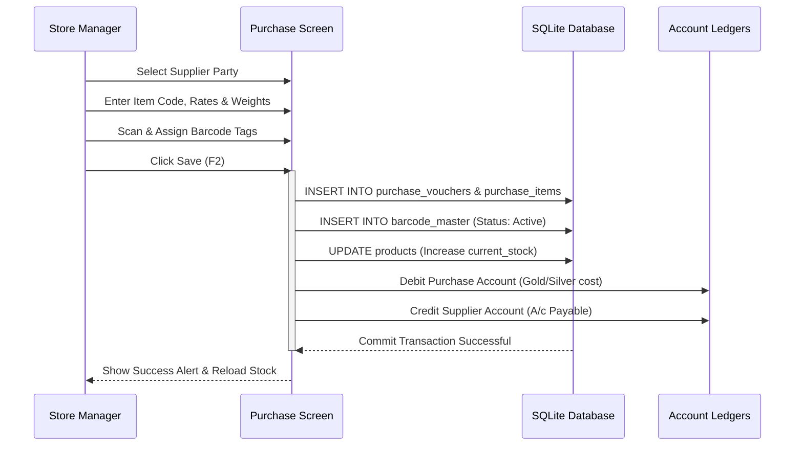
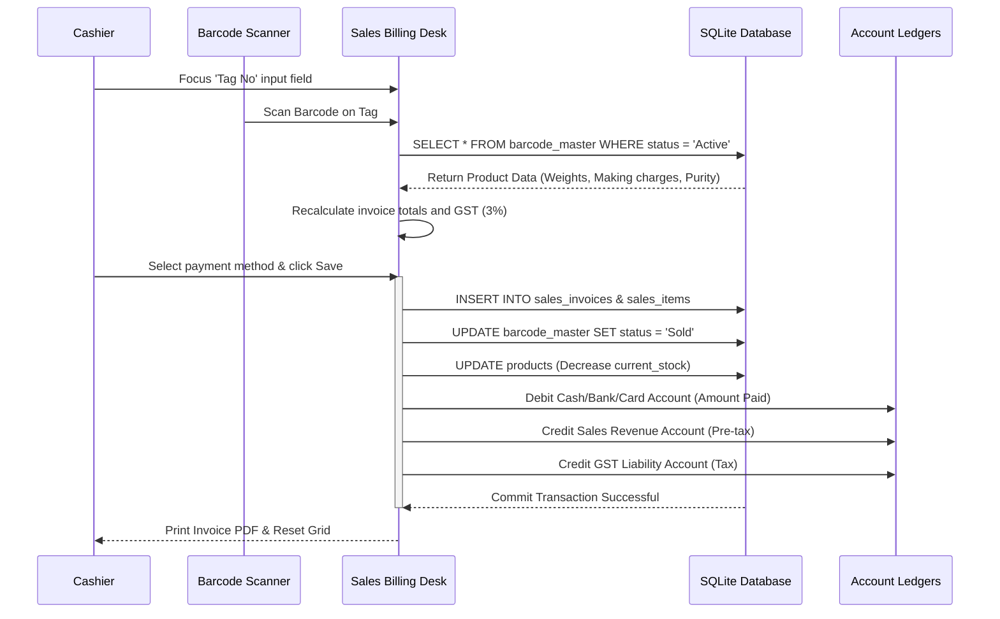
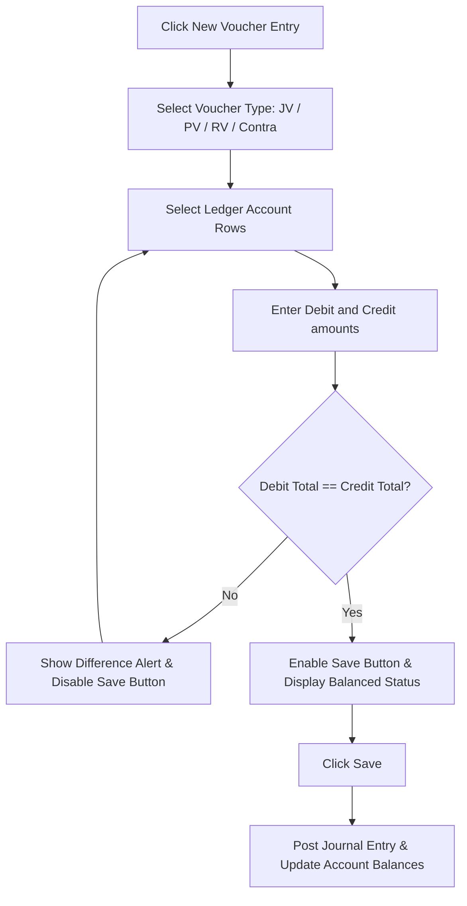

# 05 - Visual Workflow Documentation

This document contains Mermaid diagrams that map out the processes, workflows, and journeys inside the Jewellery ERP system.

---

## 🏢 Company Setup & Configuration Flow

This flowchart shows the initial setup sequence required when configuring a new client database.

---

## 📥 Purchase Inward Workflow

This diagram shows the inventory and ledger updates that occur during stock procurement.

---

## 📤 Sales Billing & Point-of-Sale Checkout

This sequence diagram shows the checkout validation and transaction updates that occur when a sale is finalized.

---

## 📈 Accounting Voucher Balancing Flow

This flowchart shows the validation rules enforced during manual journal entry postings.

