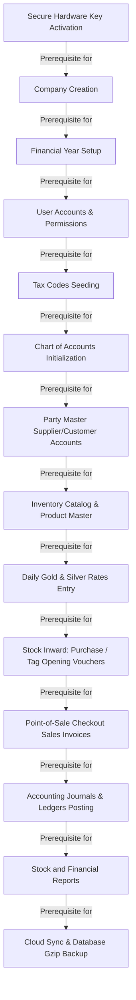

# 06 - Feature Dependency & Initialization Map

This document defines the functional dependencies of the Jewellery ERP system. Certain screens and operations are locked or will fail if their prerequisites are not configured first.

---

## 🗺️ Functional Dependency Diagram

The flowchart below shows the sequence of steps required to initialize the system and begin processing transactions:

---

## 🔗 Detail of System Prerequisite Chains

The table below explains why each step in the dependency chain is required:

| Feature | Depends On | Why the Dependency Exists | System Error if Missing |
| :--- | :--- | :--- | :--- |
| **Company Workspace** | License Registry | The database is locked and the UI is blocked if a machine-bound licence is not activated. | Displays the **System Secure Lock** screen on startup. |
| **Financial Year** | Company Profile | Transactions must be partitioned by company and financial year to generate correct accounting records. | Database insert errors due to missing `company_id` foreign keys. |
| **User Rights** | Company Profile | Users must be associated with a company profile to load their role-based permissions (RBAC). | Cannot login or navigate past the company selection dropdown. |
| **Chart of Accounts** | Company Profile | double-entry accounting transactions must map to ledger account codes assigned to the active company workspace. | Dropdown lists for Cash, Bank, Sales, and Purchase accounts are empty. |
| **Products Catalog** | Company Profile | Inventory catalog items must be bound to a company profile to isolate stock levels between different branches. | Cannot scan barcode tags or add items to purchase vouchers. |
| **Daily Rates** | Products / Catalog | Gold and Silver sales prices rely on daily market prices. Invoices require active daily rates to perform calculations. | Metal value calculations default to zero or fall back to static database defaults. |
| **Purchase Inward** | Supplier Party | Purchase vouchers must reference a registered manufacturer or supplier account code. | Cannot save purchase entries due to database constraints on `parties`. |
| **Stock Tag Opening** | Company Profile | Tag Opening vouchers register barcodes as "Active" stock. Untagged items cannot be scanned. | Cannot scan item barcodes on the Sales desk. |
| **Sales POS Checkout** | Active Stock Tags | The POS billing desk requires scanned barcodes to exist as active stock in the database. | Shows the warning message **"Barcode/Tag code not found in database"** at checkout. |
| **Ledger Reporting** | Sales & Purchases | Account ledger reports aggregate balances from journal vouchers and sales/purchase invoices. | Ledger reports are empty or display zero balances. |
| **Backup / Cloud Sync** | SQLite DB State | Backup and sync services require a valid database state and configuration parameters to export data. | Displays the error message **"Active company profile not found"** during sync. |

---

## 🚫 Safe-guards & Lockouts

To prevent user error, the system enforces the following constraints:
1. **Unbalanced Journal Entries Lockout**: The **Post Ledger Voucher** button on the Accounting screen is disabled if the debit total does not equal the credit total.
2. **Barcode Uniqueness Check**: During purchase entry or tag opening, scanning a barcode that already exists in the database displays an alert and blocks the save action to prevent duplicate tags.
3. **Daily Rates Requirement**: Generating an invoice without entering daily rates displays a warning, requiring you to enter prices before calculating precious metal values.
