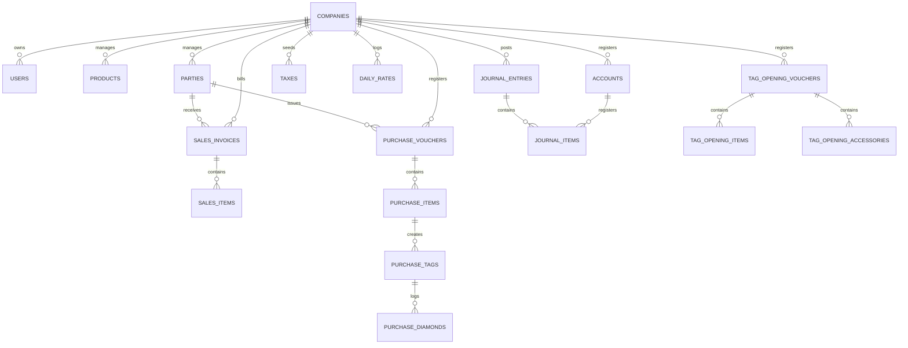

# 07 - Database Architecture & Transaction Flows

This document details the SQLite database architecture for the SwarnPro ERP system, mapping out table structures, relationships, and the data flow between UI screens and database tables.

---

## 🗺️ Entity Relationship Diagram (ERD)

This diagram shows the primary tables in the SQLite database and their relationships:

---

## 🖥️ Screen-to-Table Transaction Flows

The table below maps UI screens to the database tables they write to during transactions:

| Screen Name | Target Tables | Primary Operations |
| :--- | :--- | :--- |
| **Company Master** | `companies` | Creates and updates company profiles and financial years. |
| **User Rights** | `users` | Manages user credentials, roles, and custom permission settings. |
| **Party Master** | `parties` | Stores account details for Suppliers, Customers, Gold Smiths, and Karat smiths. |
| **Tax Master** | `taxes` | Stores GST rates, tax percentages, and accounting ledger mappings. |
| **Inventory Catalog** | `products` | Manages catalog details (SKUs, weights, selling prices, stock levels). |
| **Daily Rate** | `daily_rates` | Logs daily Gold 24K, 22K, 18K, and Silver rates. |
| **Stock Tag Opening** | `tag_opening_vouchers`, `tag_opening_items`, `tag_opening_accessories`, `barcode_master` | Registers and tags opening inventory, adding items to active stock. |
| **Labour Rates** | `party_wise_labour` | Configures custom labour rates and wastage percentages for specific parties. |
| **Purchase Invoicing** | `purchase_vouchers`, `purchase_items`, `purchase_tags`, `purchase_diamonds`, `barcode_master`, `products` | Saves purchase transactions, registers barcodes, and updates inventory stock levels. |
| **Sales Invoicing / POS** | `sales_invoices`, `sales_items`, `barcode_master`, `products`, `scan_history` | Saves sales transactions, marks barcodes as sold, and updates stock levels. |
| **Ledger Vouchers** | `journal_entries`, `journal_items` | Posts double-entry transaction vouchers (Journal, Receipt, Payment, Contra). |
| **Scanner Settings** | `device_configuration`, `printer_configuration` | Stores scanner connection modes and printer label templates. |
| **Licensing** | `license_info` | Stores active license keys, Device IDs, and expiry dates. |

---

## 🔑 Key Table Schema Definitions

### 1. Parties Table (`parties`)
Stores details for all customer and supplier accounts. The `sales_invoices` and `purchase_vouchers` tables reference this table for transaction accounting:
* **Primary Key**: `id` (UUID text)
* **Unique Key**: `(company_id, code)`
* **Key Fields**: `code`, `name`, `mobile`, `pan_no`, `gst_no`, `state`, `opening_amount`, `opening_gold`, `opening_silver`.

### 2. Barcode Master Table (`barcode_master`)
The central registry for barcode tracking. Used to validate scans and prevent double-selling:
* **Primary Key**: `id` (UUID text)
* **Unique Key**: `(company_id, barcode_value)`
* **Foreign Key**: `entity_id` references the originating table (`products`, `purchase_tags`, or `tag_opening_items`).
* **Constraints**: `status` must be one of `('Active', 'Sold', 'Damaged', 'Returned')`.

### 3. Sales Invoices Table (`sales_invoices`)
Stores the header details for sales invoices. The `sales_items` table references this table:
* **Primary Key**: `id` (UUID text)
* **Unique Key**: `(company_id, invoice_number)`
* **Foreign Key**: `customer_id` references `parties(id)` (previously referenced `customers(id)` before data migrations).
* **Constraints**:
  - `invoice_type` must be one of `('Retail', 'Wholesale', 'GST', 'Estimate')`.
  - `payment_mode` must be one of `('Cash', 'Bank', 'Card', 'UPI', 'Mixed')`.

### 4. Journal Entries & Items (`journal_entries` & `journal_items`)
Stores the ledger transactions generated by double-entry vouchers:
* **Journal Entries**: Stores the transaction date, type (`Sales`, `Purchase`, `Payment`, `Receipt`, `Contra`, `Journal`), voucher number, and narration.
* **Journal Items**: Stores debit and credit allocations for each ledger account (`account_id` references `accounts(id)`). Enforces double-entry rules (debits must equal credits).
